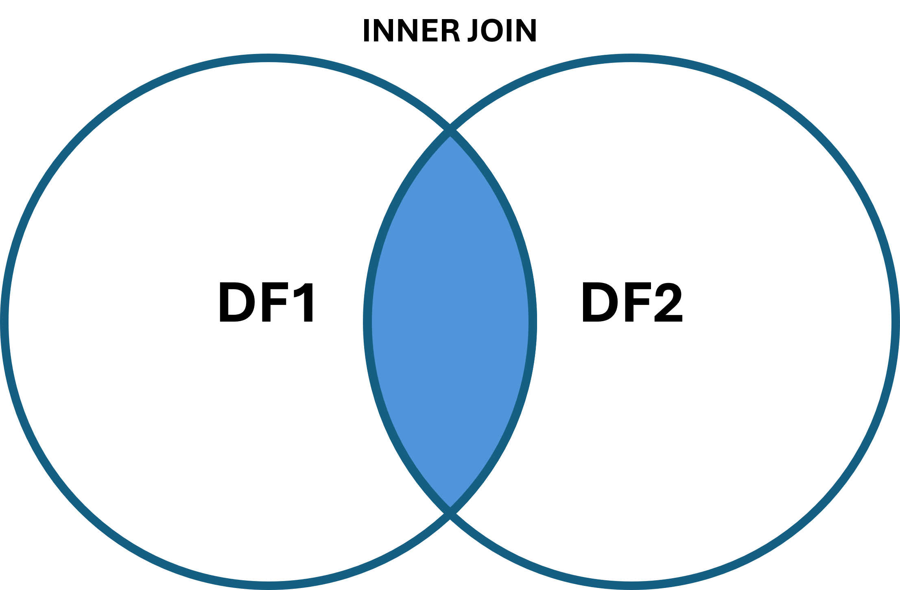
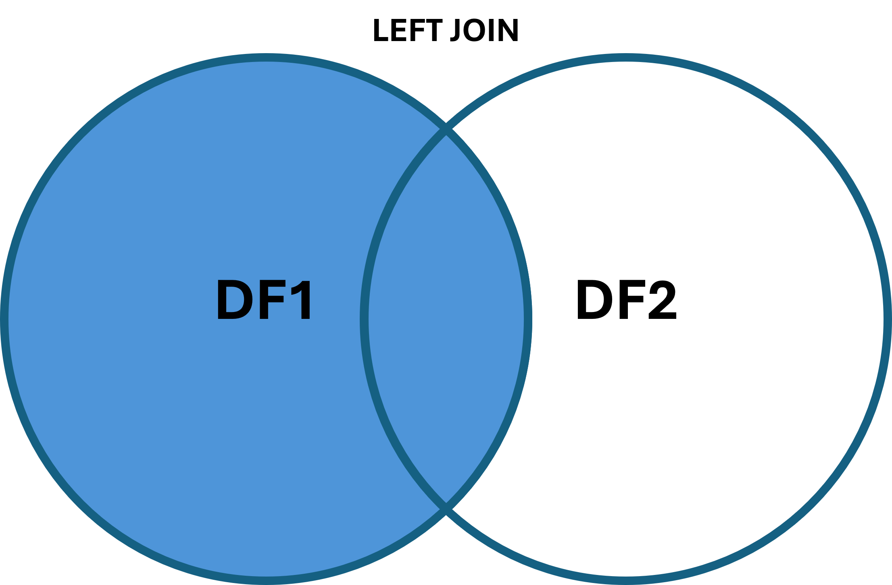
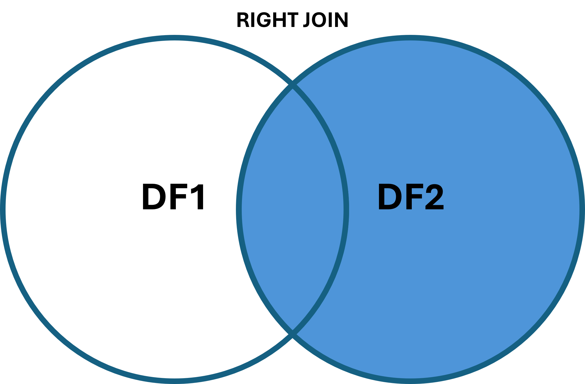
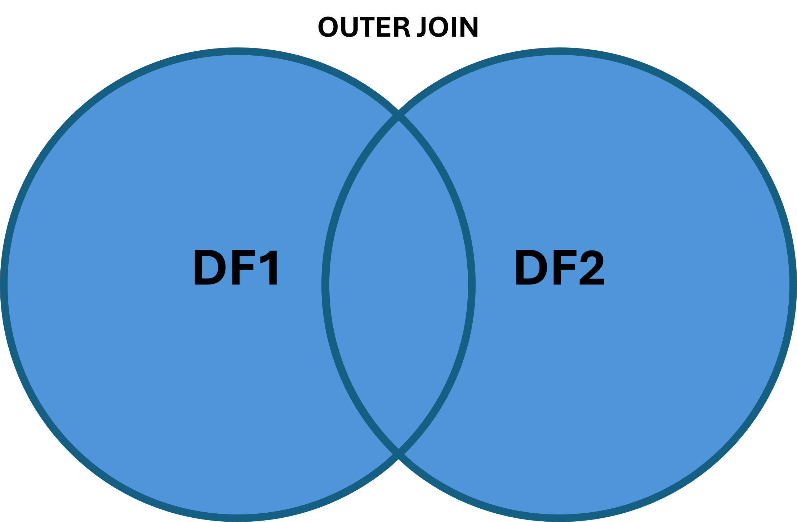

```{r setup, include=FALSE}
# when rendering the notebook in html, we limit the output to 30 rows
options(max.print = 30)
```

# 1. Datasets and dataframes

When working with data we often times have data in tabular formats like comma-separated files. 
We load them as Dataframes and perform operations on columns and roes. This notebook will demonstrate common operations and strategies to handle these datasets.

```{r}
# we first load the dataset
df_iris <- read.csv("datasets/iris.csv")
#Summarize 
summary(df_iris)
```
# 2. exploring the data

Next, we will start explore our data.

```{r}
#Select a column
df_iris$sepal_length
```
```{r}
#Select multiple columns
df_iris[, c("sepal_length", "sepal_width")]
```
```{r}
#Select multiple columns and only specific rows
df_iris[1:10, c("sepal_length", "sepal_width")]
```
```{r}
#Find indexes that match a condition
df_iris$sepal_length>6.0
```
```{r}
# Conditional selection
df_iris[df_iris$sepal_length > 6.0,]
```
```{r}
# Multiple Conditions
df_iris[df_iris$sepal_length > 6.0 & df_iris$species== "versicolor",]
```
```{r}
df_iris[df_iris$sepal_length > 6.0 | df_iris$species== "versicolor",]
```

# 3. Handling missing values

Now that we have know how to explore our data, we want to look into handling missing values. As the `iris` dataset is complete, we will load a different dataset which has missing or empty values. 

```{r}
# load dataset
df_titanic <- read.csv("datasets/titanic.csv")
df_titanic
```

```{r}
# Identify missing data
missing_data = is.na(df_titanic)
missing_data_counts = colSums(missing_data)
missing_data_counts
```
```{r}
# the missing data does not take into account blank values. For the computer, an empty but defined string is not missing just empty.
# In the preview below, don't forget to click through the column pages. You will see the deck column having loads of empty values

# Adjust for blank values as missing
is_missing <- function(x) {
  is.na(x) | x == ""
}

missing_data <- is_missing(df_titanic)
missing_data_counts <- colSums(missing_data)
missing_data_counts
```

### Option 1: Drop rows with missing values
There are different strategies, how to handle missing data. The most straight forward one is just dropping all rows in our dataframe.
The drawback is, that you potentially drop quite a few rows as you can see below. The initial dataset has 891 entries, after filtering we are left with 182.
```{r}
df_titanic_clean <- df_titanic[rowSums(missing_data)==0,]
df_titanic_clean
```

### Option 2: Fill missing values with default value
We can also fill our missing values with default values. 
We simply replace every `NA` value with the value `0`.
NOTE: This method will automatically cast the default value to the columns datatype. So if the column is a `character/string` column, it will impute the value as a string (`"0"`).
```{r}
df_titanic_copy <- df_titanic
# this will write a zero in place of 
df_titanic_copy[missing_data] <- 0

# we check how many missing values are left after our imputation
missing_data_copy = is_missing(df_titanic_copy)
missing_data_copy_counts = colSums(missing_data_copy)
missing_data_copy_counts
```

### Option 3: Fill missing values with mean value
Another approach is to fill in the empty or missing values with the mean of all other values in the column. 
This does only work for numerical columns. Here we will do it for the `age` column. 
NOTE: For this example we negate the mean, so you can more easily see which values have been filled in. 
```{r}
df_titanic_copy <- df_titanic

missing_age <- is_missing(df_titanic_copy$age)
dim(df_titanic_copy[missing_age,])
mean_age <- mean(df_titanic_copy[!missing_age,]$age)
mean_age 
df_titanic_copy[missing_age,]$age <- mean_age

# we check how many missing values are left after our imputation
missing_data_copy = is_missing(df_titanic_copy)
missing_data_copy_counts = colSums(missing_data_copy)
missing_data_copy_counts
```

### Option 4: Fill missing values with the most frequent (mode) value
And as the last approach we fill in the empty or missing values with the most frequent of all other values in the column. 
This does work for all columns types. The most frequent value is also called mode. Here we will apply this mutation to the `deck` column.
NOTE: For this example we add a prefix to the filled in value, so you can more easily see which values have been filled in. 
```{r}
# Define a function for calculating mode
mode <- function(x) {
  missing_values <- is_missing(x)
  uniq_x <- unique(x[!missing_values])
  uniq_x[which.max(tabulate(match(x, uniq_x)))]
}

# Fill missing values in `deck` with the mode
most_freq_val <- mode(df_titanic_copy$deck)
most_freq_val

missing_deck <- is_missing(df_titanic_copy$deck)
df_titanic_copy[missing_deck,]$deck <- most_freq_val

# we check how many missing values are left after our imputation
missing_data_copy = is_missing(df_titanic_copy)
missing_data_copy_counts = colSums(missing_data_copy)
missing_data_copy_counts
```

# Renaming columns

```{r}
# we quickly reload the dataset
df_titanic_rename <- read.csv("datasets/titanic.csv")
# Rename a singular column
names(df_titanic_rename)[names(df_titanic_rename) == "class"] <- "ticket_class"

df_titanic_rename
```

# Apply functions rowwise
So far we have a looked at mainly whole dataset or whole column operations. But if you need to, you can also apply functions to each individual row and add the result as an additional column.
NOTE: We load a new small dataset in this task which contains information on diamonds. 

```{r}
# Load the diamonds dataset
df_diamonds <- read.csv("datasets/diamonds.csv")

# Define the function
price_per_carat <- function(row) {
  carat_value <- as.numeric(row["carat"])
  price_value <- as.numeric(row["price"])
  
  if (carat_value > 0) {
    return(price_value / carat_value)
  } else {
    return(0)
  }
}

# Apply row-wise function
df_diamonds$price_per_carat <- apply(df_diamonds, 1, price_per_carat)
# The new column is appended as the last column (you might need to navigate to more columns)
df_diamonds
```

# Data Aggregation and Grouping

We can group our data by some categorical variable and get the mean of all other features.

```{r}
# Aggregate data by species, calculating the mean for all other columns
grouped <- aggregate(. ~ species, data = df_iris, FUN = mean)
grouped
```

# Merging

If we have more than one dataframe but they shard an index on which we want to merge them (e.g. two runs of the data) we can merge (i.e. join) them.

```{r}
# First define our two dataframes
df1 <- data.frame(
  A = c('A0', 'A1', 'A2', 'A3'),
  B = c('B0', 'B1', 'B2', 'B3'),
  key = c('K0', 'K1', 'K2', 'K3')
)

df2 <- data.frame(
  C = c('C0', 'C1', 'C2', 'C3'),
  D = c('D0', 'D1', 'D2', 'D3'),
  key = c('K0', 'K1', 'K2', 'K4')
)

df1
df2
```

### Inner join
The inner join merges the dataframe on an index and only keeps rows from both dataframe that lie in the intersection according to the index. 
In the result we see the entries with `key == K3` from `df1` and `key == K4` from `df2` missing as they are only present in their respective dataframes but not in the intersection.



```{r}
inner_join <- merge(df1, df2, by = "key", all = FALSE)
inner_join
```


### Left join
The left join merges the dataframe on an index and keeps all entries from the `left` dataframe while adding the entries from the intersection with the `right` dataframe on an index column. 
In the result we see the entry with `key == K4` from `df2` missing as it from the `right` (`df2`) dataframe and not in the intersection with the `left` (`df1`) one.
You can also see the entry with `key == K3` does not have values for columns `C` or `D` as it is not present in `df2`.



```{r}
left_join <- merge(df1, df2, by = "key", all.x = TRUE)
left_join
```

### Right join
The right join is just the opposite of the left join. You can always swap the order of dataframes to get from left to right join. 
In the result we see the entry with `key == K3` from `df1` missing as it from the `left` (`df1`) dataframe and not in the intersection with the `right` (`df2`) one.



```{r}
right_join <- merge(df1, df2, by = "key", all.y = TRUE)
right_join
```

### Outer join
The outer join takes the union over both dataframes, so where our inner join dropped the entries with `key == K3 || key == K4`, they are now included.



```{r}
outer_join <- merge(df1, df2, by = "key", all = TRUE)
outer_join
```

### Concatenation

Sometimes you don't want to combine columns from dataframes but rather just concatenate their rows with different data points.
In concatenation we do not merge on a key column. 
NOTE: In this native R function the `rbind` function assumes, that both dataframes have the same column names such that it can concatenate without adding null values. 
For concatenating dataframes with differing columns, see the `03_2` notebook.
```{r}
df1 <- data.frame(
  A = c('A0', 'A1', 'A2', 'A3'),
  B = c('B0', 'B1', 'B2', 'B3'),
  key = c('K0', 'K1', 'K2', 'K3')
)

df2 <- data.frame(
  A = c('A4', 'A5', 'A6', 'A7'),
  B = c('B4', 'B5', 'B6', 'B7'),
  key = c('K4', 'K5', 'K6', 'K7')
)

concatenated <- rbind(df1, df2)
concatenated
```


